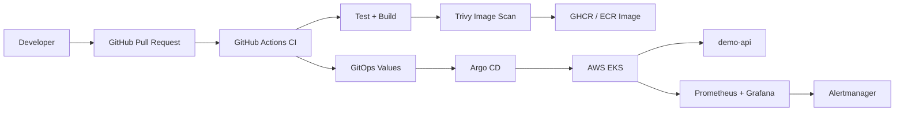

# GitOps Platform on EKS


> Production-style GitOps reference project using AWS EKS, Terraform, Argo CD, Helm, GitHub Actions, Prometheus and Grafana.

> **Portfolio / mock project scope**  
> This repository is a self-contained portfolio project. It is not connected to a real company environment and does not contain production secrets, customer data, or live cloud credentials. The goal is to showcase how a serious GitOps platform can be structured, documented, validated, and operated using real-world DevOps practices.

## Why this project exists

This project demonstrates how I would design a clean GitOps delivery platform for a cloud-native application running on Kubernetes. It focuses on clarity, maintainability, operational readiness, and observability rather than deploying a costly production environment by default.

The repository can be reviewed as an architecture/code sample, and the Kubernetes pieces can be adapted for a real EKS cluster or tested locally with Kind/Minikube after replacing the repository and image placeholders.

## What this repo demonstrates

- AWS network and EKS provisioning using Terraform modules.
- ECR repository creation for immutable application images.
- Argo CD app-of-apps bootstrap.
- ApplicationSet-based multi-environment delivery.
- Helm chart with probes, HPA, PDB, NetworkPolicy, ServiceMonitor, and PrometheusRule.
- GitHub Actions pipeline for Maven tests, image build, Trivy scan, GHCR publishing, Helm lint, and Helm template validation.
- kube-prometheus-stack configuration and Grafana dashboard-as-code.
- Runbooks, security notes, and architecture decisions.

## Architecture



## Repository structure

```text
apps/demo-api/              Spring Boot demo service exposing Actuator + Prometheus metrics
apps/demo-api/chart/        Production-style Helm chart for the demo service
argocd/                     App-of-apps bootstrap, projects, and ApplicationSets
environments/               dev/staging/prod Helm values
infra/terraform/            AWS platform infrastructure-as-code
monitoring/                 kube-prometheus-stack values and dashboard-as-code
scripts/                    Bootstrap and operator helper scripts
docs/                       Architecture, runbook, security notes, and ADRs
screenshots/                Curated screenshots for the portfolio README
```

## Demo application

The included `demo-api` is intentionally small. Its purpose is to provide a real deployable service with:

- Spring Boot 3 / Java 17
- `/api/platform` demo endpoint
- `/actuator/health` health endpoint
- `/actuator/prometheus` metrics endpoint
- custom Prometheus counter: `demo_api_platform_requests_total`

## Local validation

```bash
make test
make docker-build
make helm-lint
make helm-template
```

## Quick local GitOps demo with Kind

Create a local cluster:

```bash
make kind-up
```

Install Argo CD:

```bash
make install-argocd
```

Bootstrap the app-of-apps root application:

```bash
make bootstrap-gitops REPO_URL=https://github.com/Yasserkb/gitops-platform-eks.git
```

Replace `Yasserkb` with your GitHub account or organization before using the GitOps bootstrap flow.

## AWS deployment path

The Terraform code is provided as a realistic EKS platform blueprint. Before applying it to a real AWS account, review cost, networking, IAM, cluster endpoint exposure, node sizing, and backend state configuration.

```bash
cd infra/terraform/environments/dev
terraform init
terraform plan -out tfplan
terraform apply tfplan
aws eks update-kubeconfig --region eu-west-1 --name yasser-gitops-dev
```

## Screenshots to add

Add real screenshots after running the local or cloud demo:

```text
screenshots/
├── argocd-apps-synced.png
├── grafana-dashboard.png
├── github-actions-ci.png
├── helm-template-validation.png
├── kubernetes-workloads.png
└── prometheus-targets.png
```

## Production notes

This project intentionally keeps secrets out of Git. In a real platform, use External Secrets Operator with AWS Secrets Manager, Sealed Secrets, or SOPS with KMS. For production-grade cloud deployment, also add remote Terraform state, OIDC federation from GitHub Actions to AWS, stricter NetworkPolicies, admission policies, backup/restore strategy, and cost controls.

## Status

This repository is a **portfolio-grade reference implementation**. It is designed to be easy to inspect, explain in interviews, and extend into a real production platform.
